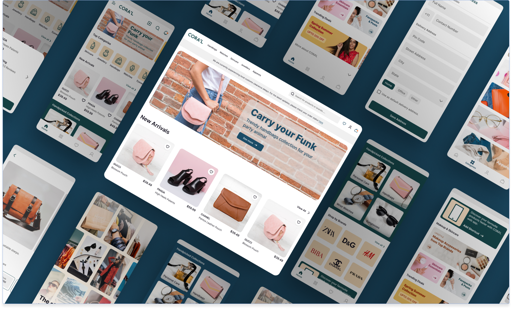

<h1 align="center">
    
</h1>

<h1 align="center">
   <a href="#">PWA eCommerce Theme</a>
</h1>

<h3 align="center">
    Final Challenge - Phase 1, of our Front-end Scholarship Program: React.js!
</h3>

  

  

  
    
   
   

<h4 align="center"> 
	 Status: Done
</h4>

 <a href="#about">About</a> •
 <a href="#features">Features</a> •
 <a href="#author">Author</a> • 
 <a href="#user-content-license">License</a>

## About

Thiago decided to enter the e-commerce sector (online sales), in addition, he decided to create his own app. Wanting his app to be developed with the best technologies, he contacted compass.uol. This application aims to provide a better experience for online shoppers, with the application of Design system, innovative flows and clean layout.

"npm install" for install the dependences
"Npm run dev" for localhost
"npm run storybook" for storybook

Currently working for mobile screens: 420px and desktop: 1440px.

---

## Features
- [X] page home
    - [X] Header
    - [X] carousel
    - [X] categories (mobile)
    - [X] new arrivals
    - [X] Handpicked Collections (categories)
    - [X] shop by brands
    - [X] Makeup & Skincare
    - [X] Trending Deals
    - [X] banners
    - [X] footer More about CORA'L
    - [X] navbar fixed in bottom
    - [X] bottom sheet

- [X] category page
    - [X] banner
    - [X] must have 4 different types of categories for 4 pages with different products
    - [X] number navigation
    - [X] filter items
    - [X] when clicking on the icon to open a modal

- [X] product page
    - [X] structure
    - [X] styling
    - [X] quantity logic and increase value based on quantity

- [X] storybook
    - [X] Header and Footers
        - [X] header web
        - [X] footer web
        - [X] mobile footer
        - [X] app bar
        - [X] bottom navigation
    - [ ] Elements
        - [X] buttons and chips
        - [X] assembly
        - [X] banners
        - [X] Accordion
        - [ ] Checkboxes and Radio Buttons
        - [X] buttons and chips
    - [X] Menu
        - [X] Tabs and Breadcrumbs
        - [X] Ratings and Stepper
        - [X] SearchBar
    - [X] Form Control
        - [X] label
    - [X] Style Guide
        - [X] Typography
        - [X] Inter
        - [X] Colors
        - [X] Icons
    - [X] cards
        - [X] Miscellaneous Elements
        - [X] Horizontal Cards
  
---

## Author

<a href="#">
 
<h2>Robert José</h2>

 

---

## License

This project is under the license [MIT](./LICENSE).

Made with love by Robert J. :)